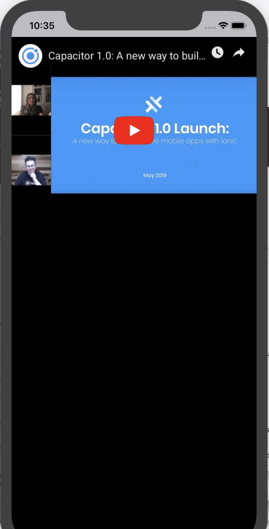

![Built With Capacitor](https://img.shields.io/badge/-Built%20With%20Capacitor-16161d.svg?logo=data%3Aimage%2Fsvg%2Bxml%3Bbase64%2CPD94bWwgdmVyc2lvbj0iMS4wIiBlbmNvZGluZz0idXRmLTgiPz4KPCEtLSBHZW5lcmF0b3I6IEFkb2JlIElsbHVzdHJhdG9yIDE5LjIuMSwgU1ZHIEV4cG9ydCBQbHVnLUluIC4gU1ZHIFZlcnNpb246IDYuMDAgQnVpbGQgMCkgIC0tPgo8c3ZnIHZlcnNpb249IjEuMSIgaWQ9IkxheWVyXzEiIHhtbG5zPSJodHRwOi8vd3d3LnczLm9yZy8yMDAwL3N2ZyIgeG1sbnM6eGxpbms9Imh0dHA6Ly93d3cudzMub3JnLzE5OTkveGxpbmsiIHg9IjBweCIgeT0iMHB4IgoJIHZpZXdCb3g9IjAgMCA1MTIgNTEyIiBzdHlsZT0iZW5hYmxlLWJhY2tncm91bmQ6bmV3IDAgMCA1MTIgNTEyOyIgeG1sOnNwYWNlPSJwcmVzZXJ2ZSI%2BCjxzdHlsZSB0eXBlPSJ0ZXh0L2NzcyI%2BCgkuc3Qwe2ZpbGw6I0ZGRkZGRjt9Cjwvc3R5bGU%2BCjxwYXRoIGNsYXNzPSJzdDAiIGQ9Ik00MjQuNywzNzMuOWMwLDM3LjYtNTUuMSw2OC42LTkyLjcsNjguNkgxODAuNGMtMzcuOSwwLTkyLjctMzAuNy05Mi43LTY4LjZ2LTMuNmgzMzYuOVYzNzMuOXoiLz4KPHBhdGggY2xhc3M9InN0MCIgZD0iTTQyNC43LDI5Mi4xSDE4MC40Yy0zNy42LDAtOTIuNy0zMS05Mi43LTY4LjZ2LTMuNkgzMzJjMzcuNiwwLDkyLjcsMzEsOTIuNyw2OC42VjI5Mi4xeiIvPgo8cGF0aCBjbGFzcz0ic3QwIiBkPSJNNDI0LjcsMTQxLjdIODcuN3YtMy42YzAtMzcuNiw1NC44LTY4LjYsOTIuNy02OC42SDMzMmMzNy45LDAsOTIuNywzMC43LDkyLjcsNjguNlYxNDEuN3oiLz4KPC9zdmc%2BCg%3D%3D&colorA=16161d&style=flat-square)


# CapacitorYoutubePlayer

<p align="center">
[](https://github.com/abritopach)
[](https://www.npmjs.com/package/capacitor-youtube-player)
[](https://www.npmjs.com/package/capacitor-youtube-player)
[](https://www.npmjs.com/package/capacitor-youtube-player)
[](https://img.shields.io/github/license/abritopach/capacitor-youtube-player)
</p>

Capacitor Youtube Player is a custom Native Capacitor plugin to show Youtube Player on Web, IOS and  Android platforms.


<a href="https://www.buymeacoffee.com/h6WVj4HcD" target="_blank"></a>

# Capacitor

Capacitor is a cross-platform API and code execution layer that makes it easy to call Native SDKs from web code and to write custom Native plugins that your app might need. Additionally, Capacitor provides first-class Progressive Web App support so you can write one app and deploy it to the app stores, and the mobile web.

Capacitor is being designed by the Ionic Framework team as an eventual alternative to Cordova, though backwards compatibility with Cordova plugins is a priority and is actively being worked on. Capacitor can be used without Ionic Framework, but soon it'll become a core part of the Ionic developer experience.

Capacitor also comes with a Plugin API for building native plugins. On iOS, first-class Swift support is available, and much of the iOS Capacitor runtime is written in Swift. Plugins may also be written in Objective-C. On Android, support for writing plugins with Java and Kotlin is supported.

## Plugin preview


## Plugin log mode

When initializing a youtube player you can enable debug mode to display the logs in the console.

``` bash
    async initializeYoutubePlayerPluginWeb() {
      const options = {playerId: 'youtube-player', playerSize: {width: 640, height: 360}, videoId: 'tDW2C6rcH6M', debug: true};
      const result = await YoutubePlayerWeb.initialize(options);
  }
```

## Methods available

## WEB

Functionality | Methods | Description | Expects | Returns
----------------|----------------|-------------|--------|--------
Load player API & Create Player & Destroy Player | `initialize(options: {playerId: string, playerSize: IPlayerSize, playerVars?: IPlayerVars, videoId: string, debug?: boolean})` | Promise - Load player API & create player.  | JSON Object  | data
Load player API & Create Player & Destroy Player | ` destroy(playerId: string)` | Promise - Destroy player  | string | data
Playback controls and player settings | `stopVideo(playerId: string)` | Promise - Stops and cancels loading of the current video. This function should be reserved for rare situations when you know that the user will not be watching additional video in the player. If your intent is to pause the video, you should just call the pauseVideo function. If you want to change the video that the player is playing, you can call one of the queueing functions without calling stopVideo first. | string | data
Playback controls and player settings | `playVideo(playerId: string)` | Promise - Plays the currently cued/loaded video. The final player state after this function executes will be playing (1). | string | data
Playback controls and player settings | `pauseVideo(playerId: string)` | Promise - Pauses the currently playing video. The final player state after this function executes will be paused (2) unless the player is in the ended (0) state when the function is called, in which case the player state will not change. | string | data
Playback controls and player settings | `seekTo(playerId: string, seconds: number, allowSeekAhead: boolean)` | Promise - Seeks to a specified time in the video. If the player is paused when the function is called, it will remain paused. If the function is called from another state (playing, video cued, etc.), the player will play the video.  | string, number, boolean | data
Playback controls and player settings | `loadVideoById(playerId: string, options: {videoId: string, startSeconds?: number, endSeconds?: number, suggestedQuality?: string})` | Promise - Loads and plays the specified video.  | string, JSON Object | data
Playback controls and player settings | `cueVideoById(playerId: string, options: {videoId: string, startSeconds?: number, endSeconds?: number, suggestedQuality?: string})` | Promise - Loads the specified video's thumbnail and prepares the player to play the video. The player does not request the FLV until playVideo() or seekTo() is called. | string, JSON Object | data
Changing the player volume | `mute(playerId: string)` | Promise - Mutes the player. | string | data
Changing the player volume | `unMute(playerId: string)` | Promise - Unmutes the player. | string | data
Changing the player volume | `isMuted(playerId: string)` | Promise - Returns true if the player is muted, false if not. | string | data
Changing the player volume | `setVolume(playerId: string, volume: Number)` | Promise - Sets the volume. Accepts an integer between 0 and 100. | string, number | data
Changing the player volume | `getVolume(playerId: string)` | Promise - Returns the player's current volume, an integer between 0 and 100. Note that getVolume() will return the volume even if the player is muted. | string | data
Setting the player size | `setSize(playerId: string, width:Number, height:Number)` | Promise - Sets the size in pixels of the <iframe> that contains the player. | string, number, number | data
Playback status | `getVideoLoadedFraction(playerId: string)` | Promise - Returns a number between 0 and 1 that specifies the percentage of the video that the player shows as buffered. This method returns a more reliable number than the now-deprecated getVideoBytesLoaded and getVideoBytesTotal methods.  | string | data
Playback status | `getPlayerState(playerId: string)` | Promise - Returns the state of the player. Possible values are: -1 unstarted / 0 ended / 1 playing / 2 paused / 3 buffering / 5 video cued | string | data
Playback status | `getAllPlayersEventsState()` | Promise - Returns the state of events of all players. |  | Map<string, IPlayerState>
Playback status | `getCurrentTime(playerId: string)` | Promise - Returns the elapsed time in seconds since the video started playing. | string | data

## ANDROID

Functionality | Methods | Description | Expects | Returns
----------------|----------------|-------------|--------|--------
Load player API & Create Player | `initialize(options: {width: number, height: number, videoId: string}): Promise<{playerReady: boolean}>;` | Promise - Load player API & create player.  | JSON Object  | data


## IOS

Functionality | Methods | Description | Expects | Returns
----------------|----------------|-------------|--------|--------
Load player API & Create Player | `initialize(options: {width: number, height: number, videoId: string}): Promise<{playerReady: boolean}>;` | Promise - Load player API & create player.  | JSON Object  | data


## Install Plugin

``` bash
    npm install --save capacitor-youtube-player@latest
```

## Using this plugin

### IMPORTANT NOTE iOS:

Currently there is a small error when you testing the plugin in iOS. The following line of code needs to be modified in xcode:

YouTubePlayer.swift:339:102: 'UIWebViewNavigationType' has been renamed to 'UIWebView.NavigationType'

### IMPORTANT NOTE ANDROID

You have to register Youtube Player plugin's class in your Acitivity so Capacitor is aware of it.

```bash
package com.example.app;

import android.os.Bundle;

import com.abpjap.plugin.youtubeplayer.YoutubePlayer;
import com.getcapacitor.BridgeActivity;
import com.getcapacitor.Plugin;

import java.util.ArrayList;

public class MainActivity extends BridgeActivity {
  @Override
  public void onCreate(Bundle savedInstanceState) {
    super.onCreate(savedInstanceState);

    // Initializes the Bridge
    this.init(savedInstanceState, new ArrayList<Class<? extends Plugin>>() {{
      // Additional plugins you've installed go here
      // Ex: add(TotallyAwesomePlugin.class);
      add(YoutubePlayer.class); <= ADD THIS LINE
    }});
  }
}
```

In the official [Capacitor documentation](https://capacitor.ionicframework.com/docs/plugins/android#export-to-capacitor) appears how to register the plugin.


### Ionic / Angular project

1) Install the plugin.

```bash
npm install --save capacitor-youtube-player@latest
```

2) Import plugin in your page.

```bash
import { Component, OnInit, AfterViewInit } from '@angular/core';

import { YoutubePlayerWeb } from 'capacitor-youtube-player'; // Web version

import { Plugins, Capacitor } from '@capacitor/core'; // Native version

@Component({
  selector: 'app-home',
  templateUrl: 'home.page.html',
  styleUrls: ['home.page.scss'],
})
export class HomePage implements OnInit, AfterViewInit {

  currentYear = new Date().getFullYear();

  constructor() {
  }

  ngOnInit() {
  }

  ngAfterViewInit() {
    if (Capacitor.platform === 'web') {
      this.initializeYoutubePlayerPluginWeb();
    } else { // Native
      this.initializeYoutubePlayerPluginNative();
    }
  }

  async initializeYoutubePlayerPluginWeb() {
    const options = {playerId: 'youtube-player', playerSize: {width: 640, height: 360}, videoId: 'tDW2C6rcH6M'};
    const result = await YoutubePlayerWeb.initialize(options);
    console.log('playerReady', result);
  }

  async destroyYoutubePlayerPluginWeb() {
    const result = await YoutubePlayerWeb.destroy('youtube-player');
    console.log('destroyYoutubePlayer', result);
  }

  async initializeYoutubePlayerPluginNative() {

    const { YoutubePlayer } = Plugins;

    const options = {width: 640, height: 360, videoId: 'tDW2C6rcH6M'};
    const playerReady = await YoutubePlayer.initialize(options);
  }

}
```

3) Build your app.

You must build your Ionic / Angular project at least once before adding any native platforms.

```bash
    ionic build // Ionic
    ng build // Angular
```

4) Add Platforms.

```bash
    npx cap add ios
    npx cap add android
```

5) Open IDE to build, run, and deploy.

```bash
    npx cap open ios
    npx cap open android
```

## Examples

### Example Ionic project

- Plugin in Ionic project: https://github.com/abritopach/ionic-test-capacitor-youtube-player

#### WEB


#### iOS



#### Android


### Angular project

- Plugin in Angular project: https://github.com/abritopach/angular-ionic-ngxs-movies

### Vue project

- Check [examples/vue-test-capacitor-youtube-player](https://github.com/abritopach/capacitor-youtube-player/tree/master/examples/vue-test-capacitor-youtube-player) folder.

### React project

- Check [examples/react-test-capacitor-youtube-player](https://github.com/abritopach/capacitor-youtube-player/tree/master/examples/vue-test-capacitor-youtube-player) folder.
